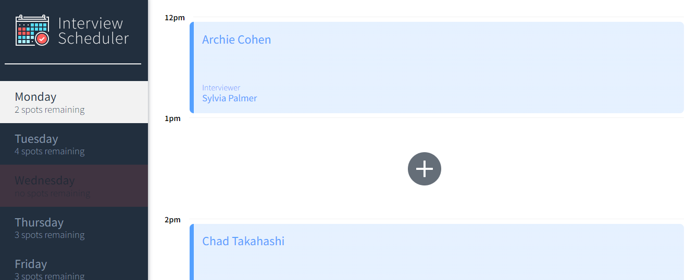

# Interview Scheduler

This project is a single-page application (SPA) built in REACT. It allows students to book/edit/delete interview appointments in a real-time.

## Features
- user friendly interface
- easy to navigate
- each weekday contains 5 appointment spots
- easy to book, edit and remove appointments
- real-time tracking of the amount of available appointment spots
- list of interviewers with avatars

## General view


## Book an Appointment


## Deleting an appointment


## Getting Started

Install dependencies with `npm install`.

## Running Webpack Development Server

```sh
npm start
```

## Running Jest Test Framework

```sh
npm test
```

## Running Storybook Visual Testbed

```sh
npm run storybook
```


## API server and DB Setup

- scheduler-api server [here](https://github.com/lighthouse-labs/scheduler-api)
- Follow README to setup the db
- install dependencies with `npm install`
- start the API server `npm start`

## Testing

Storybook, Jest, Testing Library and Cypress

## Frontend: 

React, Axios, JSX, HTML, SASS, JavaScript

## Backend: 
Express, Node.js, PostgreSQL

## Dependencies
- Axios
- Classnames
- Normalize.css
- React
- React-dom
- React-scripts
- Babel/core
- Storybook
- Testing-library/jest-dom
- Babel-loader
- Node-sass
- Prop-types
- React-test-renderer
- sass